```python
import pandas as pd
import os
import regex as re
import numpy as np
import matplotlib.pyplot as plt
import seaborn as sns

df = pd.read_csv("eda.csv") # importing partially saved data for demo processin
sns.set_style("darkgrid") # seaborn prep
sns.set_palette("muted")
```

# Exploratory Data Analysis
This notebook will explore the data scraped in the "Data Acquisition" notebook, then walk through some adjustments to the data to hopefully improve its ability to yield a useful model.
<a name="index"></a>
### Exploratory Data Analysis
1. <a href="#1">Imbalanced classes</a>
2. <a href="#2">Overrepresentation</a>
3. <a href="#3">Maximizing input data</a>
4. <a href="#4">Checking for biased classes</a>

### Optimiziation
5. <a href="#5">Some thoughts on optimization</a>
6. <a href="#6">Removing recurring text</a>
7. <a href="#7">Downsampling overrepresented artists</a>
8. <a href="#8">Removing verses with low unique token percentages</a>

### Post-optimization
9. <a href="#9">Review</a>
10. <a href="#10">Imbalanced classes revisited</a>
11. <a href="#11">Overrepresentation revisited</a>
12. <a href="#12">Conclusion and future considerations</a>

### 1. Imbalanced classes <a name="1"></a>
<a href="#index">Top</a>

As suspected, men are far more present in the data than women, both in total verses and in individual artists.


```python
fig, ax = plt.subplots(1,2, figsize=(12,5))

for ax_, data, c  in zip(
    ax, [df, df[['gender', 'verse_artist']].drop_duplicates()], ['Total Verses %' , 'Unique Artists %']
):
    sns.barplot(
        data=data['gender'].value_counts(normalize=True).to_frame(c).reset_index().rename(columns={'index':'gender'}),
        x='gender',
        y=c,
        ax=ax_
    )
    ax_.get_xaxis().get_label().set_visible(False)
    
plt.suptitle("Total Verse % and Unique Artist % by gender", size=16)    
plt.tight_layout();

```


    
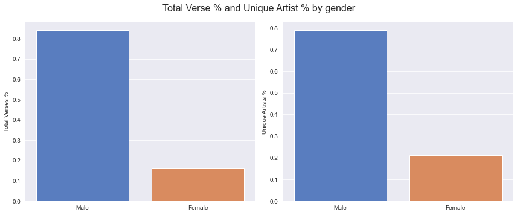
    


### 2. Overrepresentation <a name="2"></a>
<a href="#index">Top</a>

We also want to check the distribution of verses per artist to see if any artists are overrepresented in the training data.

This is clearly the case, as visible both in the number of outliers in both a straight boxplot of verses per artist, and the boxplot of the log of verses per artist. There appear to be far more overepresented male artists than female artists.


```python
fig, ax = plt.subplots(1,3, figsize=(14,5))

for ax_, data, c, t in zip(
    ax,
    [
        df.groupby('gender')['verse_artist'].value_counts(),
        df.groupby('gender')['verse_artist'].value_counts(normalize=True),
        np.log(df.groupby('gender')['verse_artist'].value_counts(normalize=True)),
    ],
    ['Count', '%', 'Log %'],
    ['Verses per Artist (total)', 'Verses per Artist (%)', 'Verses per Artist (log %)']
    
):
    ax=ax_
    ax_.get_xaxis().get_label().set_visible(False)
    ax_.title.set_text(t)
    sns.boxplot(
        data=data.to_frame().droplevel(level=1).reset_index().rename(columns={'verse_artist': c}),
        x='gender',
        y=c,
        ax=ax_,
        order=['Male', 'Female']
        )

plt.suptitle("Verses per Artist Distribution (three ways)", size=16);
plt.tight_layout()
```


    
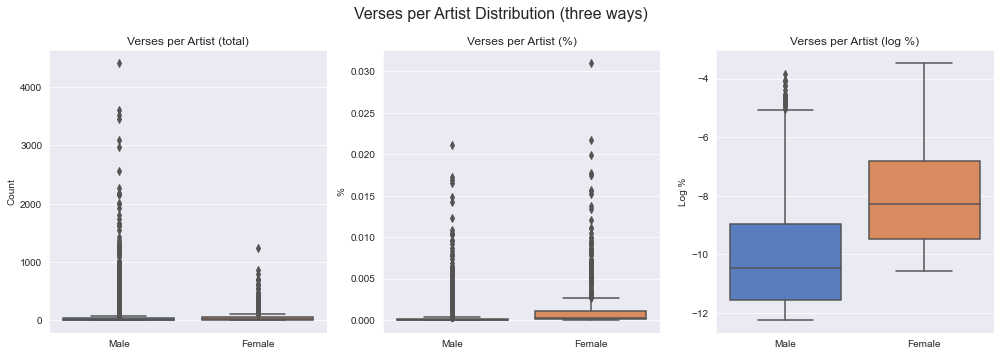
    


### 3. Maximizing input data <a name="3"></a>
<a href="#index">Top</a>

Given both the class imbalance and the probable overrepresentation of some artists, it is unlikely that we will just train a model on the entire data set. At the very least, we can make some decisions about what would best inform our model before training.

For example, **unique_token_pct** is the number of unique words in a verses divided by the total number of words in that verse. "Token" here is used loosely, as this is just unique strings (via `set(list(verse.split())`). If need be, I could remove stop words or lemmatize the inputs, but this is adequate for a first pass.

The distribution of unique token percentage is reasonably consistent between genders.

We can also look for outliers in verse length, token length and unique token length, if we want more options for our approach to tightening up the training data.


```python
fig, ax = plt.subplots(1,4, figsize=(14,5))
for ax_, t in zip(ax, ['verse_len', 'token_len', 'unique_token_len', 'unique_token_pct']):
    ax_.title.set_text(t.replace("_", " ").title())
    sns.boxplot(
        data=[
            df.query(q)[t] for q in ['gender=="Male"', 'gender=="Female"', "gender != 'v'"]
        ],
        ax=ax_,
    );
    ax_.get_xaxis().get_label().set_visible(False)
    ax_.set_xticklabels(["Male", "Female", "All"])
    


plt.suptitle("Verse Size Count (Characters, Tokens, Unique Tokens)", size=16)
plt.tight_layout()
```


    
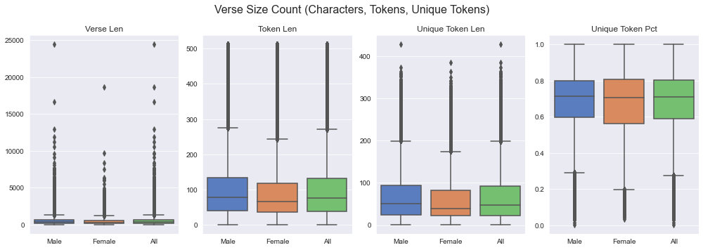
    


### 4. Checking for biased classes <a name="4"></a>
<a href="#index">Top</a>

Any feature that is correlated with or otherwise biased toward one target class over the other will be less useful in training a model.

The distribution of major verse types varies slightly across the genders, but probably not enough to worry about at this point.


```python
fig, ax = plt.subplots(1,2, figsize=(12,5))

df_ = df[df['verse_type'].isin(list(df['verse_type'].value_counts().head(5).index))
        ].groupby('gender')['verse_type']

for ax_, n, c in zip(ax, [True, False], ['%', 'count']):
    sns.barplot(
        data = df_.value_counts(
            normalize=n
        ).to_frame().rename(
            columns={'verse_type': c}
        ).reset_index().sort_values("gender", ascending=False),
        x="verse_type", y=c, hue='gender', ax=ax_
    )
    ax_.get_xaxis().get_label().set_visible(False)
    
plt.suptitle("Verse Type Distribution by Gender", size=16)
plt.tight_layout;
```


    
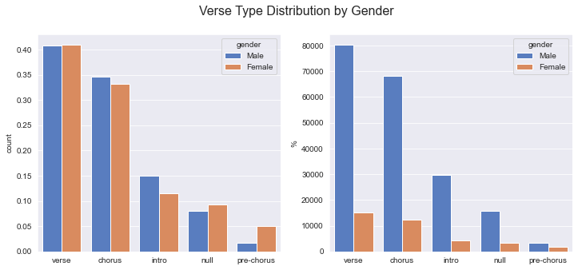
    


The data is also overwhelmingly biased towards the 2010s ...


```python
def date_filter(d):
    if d != "NO DATE":
        try:
            return int(d[:4])
        except ValueError:
            return "BAD FORMAT"
    else:
        return d
    
df['year'] = df['release_date'].map(date_filter)
df['decade'] = pd.cut(
        df['year'].replace("NO DATE", 0).replace("BAD FORMAT", 0), 
        bins=[1990, 2000, 2010, 2020, 2030],
        labels=['90s', '2000s', '2010s', '2020s']
    )
```


```python
fig, ax = plt.subplots(1,3, figsize=(14,5))

sns.barplot(
    data=df.groupby('decade')['gender'].value_counts(
        normalize=True
    ).to_frame().rename(columns={'gender':'%'}).reset_index(),
    x='decade',
    y='%',
    hue='gender',
    ax=ax[0]
);
ax[0].get_xaxis().get_label().set_visible(False)
ax[0].title.set_text('% Verses by Gender by Decade')


sns.barplot(
    data=df.groupby('gender')['decade'].value_counts(normalize=True
                                                    ).to_frame().reset_index().rename(
        columns={'decade':'%', 'level_1':'decade'}).sort_values("gender", ascending=False),
    x='gender',
    y='%',
    hue='decade',
    ax=ax[1]
);
ax[1].get_xaxis().get_label().set_visible(False)
ax[1].title.set_text('% Verses by Decade by Gender')

sns.barplot(
    data=df.groupby('gender')['decade'].value_counts(normalize=False
                                                    ).to_frame().reset_index().rename(
        columns={'decade':'Count', 'level_1':'decade'}).sort_values("gender", ascending=False),
    x='gender',
    y='Count',
    hue='decade',
    ax=ax[2]
);
ax[2].get_xaxis().get_label().set_visible(False)
ax[2].title.set_text('Verse Count by Decade by Gender')

plt.suptitle("Gender Distribution by Decade", size=16);
plt.tight_layout()
```


    
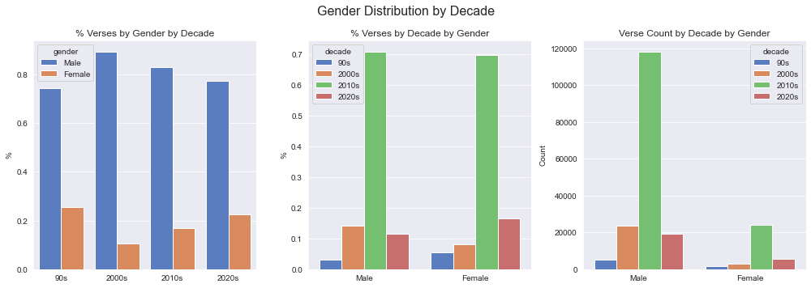
    


... although 18% of the verses have either no date or one which is misformatted (most of which are missing dates).


```python
len(df.query("year == 'NO DATE' or year == 'BAD FORMAT'"))/len(df)
```


    0.18710038491890935


```python
df['year'].map(lambda y: 0 if y not in ['NO DATE', 'BAD FORMAT'] else y).value_counts()
```


    0             201895
    NO DATE        46453
    BAD FORMAT        16
    Name: year, dtype: int64


# Optimization
### 5. Some thoughts on optimization <a name="5"></a>
<a href="#index">Top</a>

As we take steps to "optimize" the data set, we need to remember that this is not canonical data. I hand-picked the artists to include with the goal of being able to model gender differences in rap verses. All of the "problems" we identified in Exploratory Data Analysis are synthetic by-products of the selection process, not biases endemic to some "ground truth".

Given that, we could fix the problem of a 14:1 male/female class imbalance by removing male data as needed. We could solve the overrepresentation of the 2010s in the data in the same way. Augmenting the data would be "valid" in as much as nothing about this data is valid, strictly speaking.

The most important thing is to aggregate data that is sufficiently robust and diverse to adequately train a model to differentiate our two target classes. The problem with solving a class imbalance through aggressive downsampling is not the departure from reality, but the amount of training information we would lose by throwing out half of the data.

### 6. Removing recurring text <a name="6"></a>
<a href="#index">Top</a>

Let's see if there are any recurring text patterns that we might want to remove from the data.


```python
verse_count = df['verse_text'].str.lower().value_counts().to_frame().reset_index().rename(
    columns={"verse_text":"count", "index":"verse_text"})

boundaries = [10, 25, 50, 100, 250, 500, 1000]

sns.barplot(
    x=boundaries,
    y=[
            len(
                verse_count.query(f"count > {b}")
            ) for b in boundaries
        ]
    );
```


    
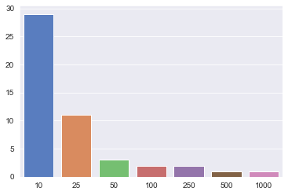
    


Adding length to prioritize, then checking manually.


```python
verse_count['verse_len'] = verse_count['verse_text'].map(len)
verse_count.query(f"count > 10").sort_values('verse_len')
```


<div>
<table border="1" class="dataframe">
  <thead>
    <tr style="text-align: right;">
      <th></th>
      <th>verse_text</th>
      <th>count</th>
      <th>verse_len</th>
    </tr>
  </thead>
  <tbody>
    <tr>
      <th>14</th>
      <td>cashmoneyap</td>
      <td>14</td>
      <td>11</td>
    </tr>
    <tr>
      <th>23</th>
      <td>bobby kritical</td>
      <td>12</td>
      <td>14</td>
    </tr>
    <tr>
      <th>2</th>
      <td>missing lyrics</td>
      <td>58</td>
      <td>14</td>
    </tr>
    <tr>
      <th>3</th>
      <td>(missing lyrics)</td>
      <td>47</td>
      <td>16</td>
    </tr>
    <tr>
      <th>18</th>
      <td>oh my god, ronny</td>
      <td>14</td>
      <td>16</td>
    </tr>
    <tr>
      <th>10</th>
      <td>yeah, yeah, yeah</td>
      <td>26</td>
      <td>16</td>
    </tr>
    <tr>
      <th>8</th>
      <td>wheezy outta here</td>
      <td>32</td>
      <td>17</td>
    </tr>
    <tr>
      <th>27</th>
      <td>d.a. got that dope</td>
      <td>11</td>
      <td>18</td>
    </tr>
    <tr>
      <th>0</th>
      <td>lyrics from snippet</td>
      <td>1313</td>
      <td>19</td>
    </tr>
    <tr>
      <th>5</th>
      <td>(wheezy outta here)</td>
      <td>35</td>
      <td>19</td>
    </tr>
    <tr>
      <th>7</th>
      <td>lyrics from\nsnippet</td>
      <td>33</td>
      <td>19</td>
    </tr>
    <tr>
      <th>11</th>
      <td>lyrics from snippet:</td>
      <td>20</td>
      <td>20</td>
    </tr>
    <tr>
      <th>1</th>
      <td>lyrics from snippets</td>
      <td>500</td>
      <td>20</td>
    </tr>
    <tr>
      <th>25</th>
      <td>(lyrics from snippet)</td>
      <td>12</td>
      <td>21</td>
    </tr>
    <tr>
      <th>17</th>
      <td>*lyrics from snippet*</td>
      <td>14</td>
      <td>21</td>
    </tr>
    <tr>
      <th>9</th>
      <td>mustard on the beat, ho</td>
      <td>29</td>
      <td>23</td>
    </tr>
    <tr>
      <th>12</th>
      <td>cook that shit up, quay</td>
      <td>18</td>
      <td>23</td>
    </tr>
    <tr>
      <th>16</th>
      <td>lyrics need transcribing</td>
      <td>14</td>
      <td>24</td>
    </tr>
    <tr>
      <th>19</th>
      <td>pum-pumbaa are you nuts?</td>
      <td>12</td>
      <td>24</td>
    </tr>
    <tr>
      <th>15</th>
      <td>we got london on da track</td>
      <td>14</td>
      <td>25</td>
    </tr>
    <tr>
      <th>26</th>
      <td>great john on the beat, by the way</td>
      <td>11</td>
      <td>34</td>
    </tr>
    <tr>
      <th>4</th>
      <td>lyrics for this song have yet to be released. ...</td>
      <td>39</td>
      <td>95</td>
    </tr>
    <tr>
      <th>13</th>
      <td>lyrics for this song have yet to be released. ...</td>
      <td>15</td>
      <td>95</td>
    </tr>
    <tr>
      <th>24</th>
      <td>\ (queen latifah)\nhe had it comin' (he had it...</td>
      <td>12</td>
      <td>168</td>
    </tr>
    <tr>
      <th>22</th>
      <td>don’t make me throw it down\ndon’t make me thr...</td>
      <td>12</td>
      <td>173</td>
    </tr>
    <tr>
      <th>21</th>
      <td>i'm gonna blow your mind, hold you close\nsque...</td>
      <td>12</td>
      <td>180</td>
    </tr>
    <tr>
      <th>28</th>
      <td>woooh, tell me what you want and i can do it t...</td>
      <td>11</td>
      <td>188</td>
    </tr>
    <tr>
      <th>6</th>
      <td>tell us that you would like to have the lyrics...</td>
      <td>34</td>
      <td>293</td>
    </tr>
    <tr>
      <th>20</th>
      <td>it's all around us everywhere we look you see ...</td>
      <td>12</td>
      <td>2139</td>
    </tr>
  </tbody>
</table>
</div>


I feel comfortable removing all everything here. These are all producer drops, "lyrics from snippet" or other non-lyrics, and the handful of long verses at the bottom are probably inconsequential given the size of the data set.


```python
df_no_overrepd_verses = df[~df['verse_text'].str.lower().isin(verse_count.query(f"count > 10")['verse_text'])]
```

### 7. Removing overrepresented artists <a name="7"></a>
<a href="#index">Top</a>

We can also downsample the most highly represented artists. As mentioned previously, a number of artists are overrepresented in the data.


```python
df_ = df_no_overrepd_verses
df_.verse_artist.value_counts().describe()
```


    count    3377.000000
    mean       72.839206
    std       250.284632
    min         1.000000
    25%         2.000000
    50%         7.000000
    75%        30.000000
    max      4406.000000
    Name: verse_artist, dtype: float64


For posterity, we can observe that the verse artist counts are a roughly lognormal distribution.


```python
df_ = df_no_overrepd_verses
verse_artist_counts = df_.verse_artist.value_counts()

fig, ax = plt.subplots(1, 4, figsize=(14,5))

for ax_, data in zip(
    ax[:2], [
        verse_artist_counts,
        np.log(verse_artist_counts),]
):
    sns.histplot(data, bins=100, ax=ax_, kde=True);
    
for ax_, data in zip(
    ax[2:], [
        verse_artist_counts,
        np.log(verse_artist_counts),]
):
    sns.kdeplot(data,ax=ax_);
    
plt.tight_layout();
```


    
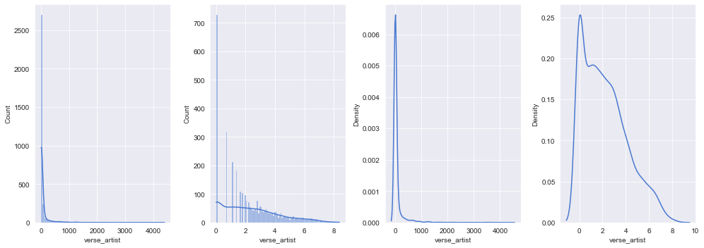
    


Given the earlier caveats about optimization, downsampling specifically overrepresented male artists is a good approach to some of the problems with the data. It will both reduce the class imbalance and decrease the overinfluence of certain artists. By keeping the verses with the highest unique token percentage, we can make sure we are getting the most information out of the data we do keep.

To decide what counts as "overrepresented", we can use the common definition of an outlier as anything 3 standard deviations above the mean.


```python
df_ = df_no_overrepd_verses

print("Verses per artist metrics:")
print(
    "Mean -",
    df_.verse_artist.value_counts().mean(), 
    "\nStandard Deviation -", 
    df_.verse_artist.value_counts().std(), 
    "\n")

outlier_artist_limit = (df_.verse_artist.value_counts().mean() + df_.verse_artist.value_counts().std()*3).astype(int)
print("Verses limit (3 standard deviations above the mean):")
print(outlier_artist_limit, "\n")

overrepd_artists = df_.query("gender == 'Male'").verse_artist.value_counts().to_frame().query(f"verse_artist > {outlier_artist_limit}").index
print("Overrepresented artists:")
print(overrepd_artists, "\n")

print("Number of overrepresented artists:")
print(len(overrepd_artists))
```

    Verses per artist metrics:
    Mean - 72.83920639620965 
    Standard Deviation - 250.28463162434105 
    
    Verses limit (3 standard deviations above the mean):
    823 
    
    Overrepresented artists:
    Index(['juice wrld', 'young thug', 'gucci mane', 'lil wayne',
           'youngboy never broke again', 'future', 'wiz khalifa', 'soulja boy',
           'curren$y', 'kanye west', 'trippie redd', 'lil yachty', 'lil uzi vert',
           'mac miller', 'lil durk', 'rick ross', 'unotheactivist', 'juicy j',
           'chief keef', 'quavo', 'french montana', 'kevin gates', 'playboi carti',
           '2 chainz', 'meek mill', 'tyga', 't.i.', 'fetty wap',
           'waka flocka flame', 'lil tecca', 'wale', 'jeezy', 'kendrick lamar',
           'yeat', 'young dolph', 'travis scott', 'rich the kid', 'don toliver',
           'gunna', 'yo gotti', 'fabolous', 'pnb rock', 'smokepurpp', 'styles p',
           'rich homie quan', 'nle choppa', 'kirko bangz', 'big sean', 'j. cole',
           'talib kweli', 'dababy', 'ace hood', 'young scooter', 'raekwon',
           'lil pump', 'kurupt', 'k camp', 'plies', 'ice cube', 'g herbo',
           'post malone'],
          dtype='object') 
    
    Number of overrepresented artists:
    61


```python
# remove overrepresented artists
df_no_overrepd_artists = df_[
    ~df_['verse_artist'].isin(overrepd_artists)
]

# save 822 verses with highest unique token percentage for each overrepresented artist
df_downsampled_artists = pd.concat(
    [df_.query(f'verse_artist=="{a}"').sort_values("unique_token_pct", ascending=False).head(
        outlier_artist_limit.astype(int)
    ) for a in overrepd_artists]
)

# combine
df_no_overrepd_artists = pd.concat([df_no_overrepd_artists, df_downsampled_artists])
    
```

### 8. Removing verses with low unique token percentages <a name="8"></a>
<a href="#index">Top</a>

Verses with a high percentage of repeated words probably won't be as useful for training the model. (I am particularly looking to remove repetitive song choruses.)


```python
df_ = df_no_overrepd_artists

sns.histplot(
    df_['unique_token_pct'],
    kde=True
);
```


    
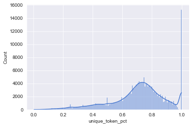
    


I'm concerned about the number of verses with 100% unique tokens.


```python
fig, ax = plt.subplots(1,2, figsize=(12,5))

for ax_, c in zip(ax, ['verse_len', 'token_len']):
    sns.histplot(
        data=df_no_overrepd_verses.query("unique_token_pct==1.0")[c],
        ax=ax_
    );
```


    
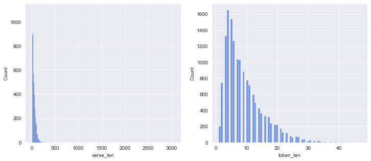
    


```python
df_.query("verse_len > 200").head()
```


<div>
<style scoped>
    .dataframe tbody tr th:only-of-type {
        vertical-align: middle;
    }

    .dataframe tbody tr th {
        vertical-align: top;
    }

    .dataframe thead th {
        text-align: right;
    }
</style>
<table border="1" class="dataframe">
  <thead>
    <tr style="text-align: right;">
      <th></th>
      <th>song_title</th>
      <th>release_date</th>
      <th>song_artist</th>
      <th>features</th>
      <th>song_id</th>
      <th>verse_text</th>
      <th>verse_index</th>
      <th>verse_header</th>
      <th>verse_type</th>
      <th>verse_artist</th>
      <th>verse_len</th>
      <th>token_len</th>
      <th>unique_token_len</th>
      <th>unique_token_pct</th>
      <th>gender</th>
      <th>year</th>
      <th>decade</th>
    </tr>
  </thead>
  <tbody>
    <tr>
      <th>18</th>
      <td>Choppa in the Trunk</td>
      <td>2016-8-19</td>
      <td>Rico Nasty</td>
      <td>Tino Loud / Chelly the MC / WillThaRapper</td>
      <td>2857067.0</td>
      <td>I got a choppa in the trunk\nCan't wait till m...</td>
      <td>2</td>
      <td>Verse 1: Rico Nasty</td>
      <td>verse</td>
      <td>rico nasty</td>
      <td>371</td>
      <td>77</td>
      <td>61</td>
      <td>0.792208</td>
      <td>Female</td>
      <td>2016</td>
      <td>2010s</td>
    </tr>
    <tr>
      <th>25</th>
      <td>Pizza Shop Extended</td>
      <td>2017-9-28</td>
      <td>IDK</td>
      <td>Del The Funky Homosapien / Yung Gleesh / MF DOOM</td>
      <td>3254957.0</td>
      <td>This that drive-by, this that Shawty Lo in Imp...</td>
      <td>2</td>
      <td>Verse 1: IDK</td>
      <td>verse</td>
      <td>idk</td>
      <td>783</td>
      <td>147</td>
      <td>104</td>
      <td>0.707483</td>
      <td>Male</td>
      <td>2017</td>
      <td>2010s</td>
    </tr>
    <tr>
      <th>26</th>
      <td>Pizza Shop Extended</td>
      <td>2017-9-28</td>
      <td>IDK</td>
      <td>Del The Funky Homosapien / Yung Gleesh / MF DOOM</td>
      <td>3254957.0</td>
      <td>Here's a little story 'bout them boys that's h...</td>
      <td>3</td>
      <td>Chorus: Yung Gleesh  IDK</td>
      <td>chorus</td>
      <td>yung gleesh</td>
      <td>585</td>
      <td>106</td>
      <td>25</td>
      <td>0.235849</td>
      <td>Male</td>
      <td>2017</td>
      <td>2010s</td>
    </tr>
    <tr>
      <th>27</th>
      <td>Pizza Shop Extended</td>
      <td>2017-9-28</td>
      <td>IDK</td>
      <td>Del The Funky Homosapien / Yung Gleesh / MF DOOM</td>
      <td>3254957.0</td>
      <td>I used to wanna hang with Dae Dae and 'em (Dae...</td>
      <td>4</td>
      <td>Verse 2: IDK</td>
      <td>verse</td>
      <td>idk</td>
      <td>665</td>
      <td>132</td>
      <td>89</td>
      <td>0.674242</td>
      <td>Male</td>
      <td>2017</td>
      <td>2010s</td>
    </tr>
    <tr>
      <th>32</th>
      <td>Coal</td>
      <td>2021-11-26</td>
      <td>IDK</td>
      <td>NaN</td>
      <td>7430098.0</td>
      <td>Three-hundred and sixty five a year\nFrom thre...</td>
      <td>2</td>
      <td>Verse</td>
      <td>verse</td>
      <td>idk</td>
      <td>828</td>
      <td>173</td>
      <td>119</td>
      <td>0.687861</td>
      <td>Male</td>
      <td>2021</td>
      <td>2020s</td>
    </tr>
  </tbody>
</table>
</div>


This is a small sample of the verses with 100% unique tokens, but a more broad look indicates they are legitimate, so we will leave them in.

On visual analysis, the change is qualitatively small. This is something else to keep in mind but fine to leave in for a first pass.


```python
df_.query("unique_token_pct < 1")['unique_token_pct'].describe()
```


    count    188574.000000
    mean          0.684783
    std           0.167332
    min           0.003623
    25%           0.613208
    50%           0.717391
    75%           0.795455
    max           0.982456
    Name: unique_token_pct, dtype: float64


```python
fig, ax = plt.subplots(1,3, figsize=(14,5))

for ax_, q, p, t in zip(
    ax,
    ['gender=="Male"', 'gender=="Female"', "gender != 'v'"],
    ['Blues', 'Reds', 'Greens'],
    ['Male', 'Female', 'All']
):
    sns.boxplot(
        data = [data.query(q)['unique_token_pct'] for data in [df_, df_.query("unique_token_pct < 1")]],
        ax=ax_,
        palette=p
    )
    ax_.set_xticklabels(["All", "Without 100% Unique Verses"])
    ax_.title.set_text(t)

plt.suptitle("Distribution of Unique Token Percentage with and without 100% Unique Verses", size=16)
plt.tight_layout();
```


    
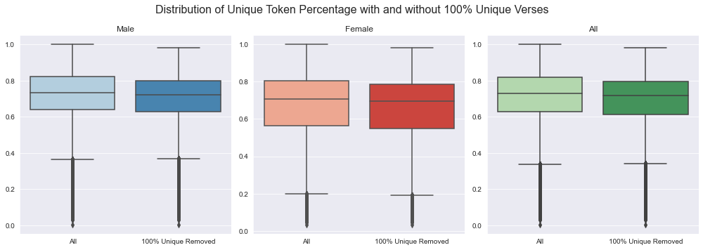
    


We can use the same definition of an outlier to define a floor for unique token percentage.


```python
print("Unique Token %:")
print(
    "Mean -",
    df_.unique_token_pct.mean(), 
    "\nStandard Deviation -", 
    df_.unique_token_pct.std(), 
    "\n")

low_token_pct_limit = df_.unique_token_pct.mean() - df_.unique_token_pct.std()*3
print("Unique Token % Floor (3 standard deviations below the mean):")
print(low_token_pct_limit)
```

    Unique Token %:
    Mean - 0.7084641718404227 
    Standard Deviation - 0.1811091910561435 
    
    Unique Token % Floor (3 standard deviations below the mean):
    0.16513659867199215


In the interest of preserving scarce female data, we will again only remove male verses here. Nudging the unique token % floor down to 0.15 for simplicity.


```python
df_unique_token_pct_floor = pd.concat([
    df_.query("gender=='Female'"), 
    df_.query("gender=='Male' & unique_token_pct > 0.15")
])
```

# Post-optimization
### 9. Review<a name="9"></a>
<a href="#index">Top</a>

Here is what we learned from our exploratory data analysis:
- Target class is imbalanced (~85% male to ~15% female)
- Significant overrepresentation of some artists
- Slight variation in verse type distribution across genders
- Significant overrepresentation from 2010s
- Significant missing 'release_date' data

Here is what we did to optimize the data before modeling:
- Removed any verse whose text occurs > 10x
- Downsampled overrepresented male artists using 3x standard deviations above the mean as the cutoff (823 verses), and using unique token percentage to determine which verses to keep
- Removed verses from male artists with < 15% unique token percentage

We can now look at the effects of our cleaning process.


```python
df_ = df_unique_token_pct_floor

df['status'] = 'Raw'
df_['status'] = 'Optimized'
```

### 10. Imbalanced classes revisited<a name="10"></a>
<a href="#index">Top</a>


```python
fig, ax = plt.subplots(1,2, figsize=(12,5))

sns.barplot(
    data=pd.concat(
    [df__.groupby('status')['gender'].value_counts(normalize=True).to_frame('Total Verses %').reset_index() for df__ in [df, df_]]
    ),
    x='status',
    y='Total Verses %',
    hue='gender',
    ax=ax[0]
);

sns.barplot(
    data=pd.concat(
    [df__[
        ['status', 'gender', 'verse_artist']
    ].drop_duplicates().groupby('status')['gender'].value_counts(normalize=True).to_frame('Unique Artists %').reset_index() for df__ in [df, df_]]
    ),
    x='status',
    y='Unique Artists %',
    hue='gender',
    ax=ax[1]
);

for ax_ in ax:
    ax_.get_xaxis().get_label().set_visible(False)

plt.suptitle("Total Verse % and Unique Artist % by gender before and after optimization", size=16)    
plt.tight_layout();

```


    
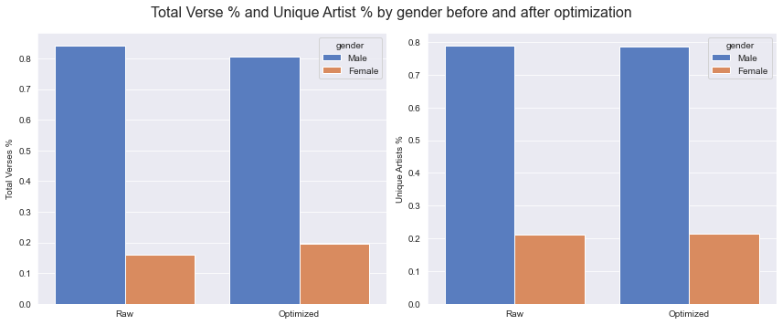
    


### 11. Overrepresentation revisited<a name="11"></a>
<a href="#index">Top</a>


```python
fig, ax = plt.subplots(1,2, figsize=(14,5))

data = [
    df__.query(q)[
        'verse_artist'
    ].value_counts(
        normalize=True
    ).values.tolist() for df__ in [df, df_] for q in ['gender=="Male"', 'gender=="Female"', "gender != 'v'"]
]

for ax_, data,t  in zip(
    ax,
    [data, [np.log(d) for d in data]],
    ['Verses per Artist (%)', 'Verses per Artist (log)']
):
    sns.boxplot(
        data=data,
        ax= ax_
    )
    
    ax_.set_xticklabels([
        "M", "M Optimized",
        "F", "F Optimized",
        "All", "All Optimized"
    ])
    ax_.title.set_text(t)
    
plt.suptitle("Verse per Artist distribution, before and after optimization", size=16);
plt.tight_layout();
```


    
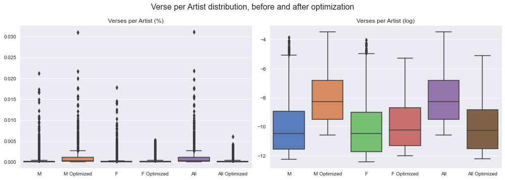
    


### 12. Conclusion and future considerations<a name="12"></a>
<a href="#index">Top</a>

Our optimization reduced the gender imbalance slightly, from ~85% m/15% f to 80% m/20% f. Downsampling improved the overrepresentation issue, at least qualitatively.

We opted to not take further steps in optimization at this time. If need be, we could do more comprehensive tokenization and calculation of unique token percentage, analysis and adjustment of release dates, analysis of verse types, and more aggressive downsampling.
